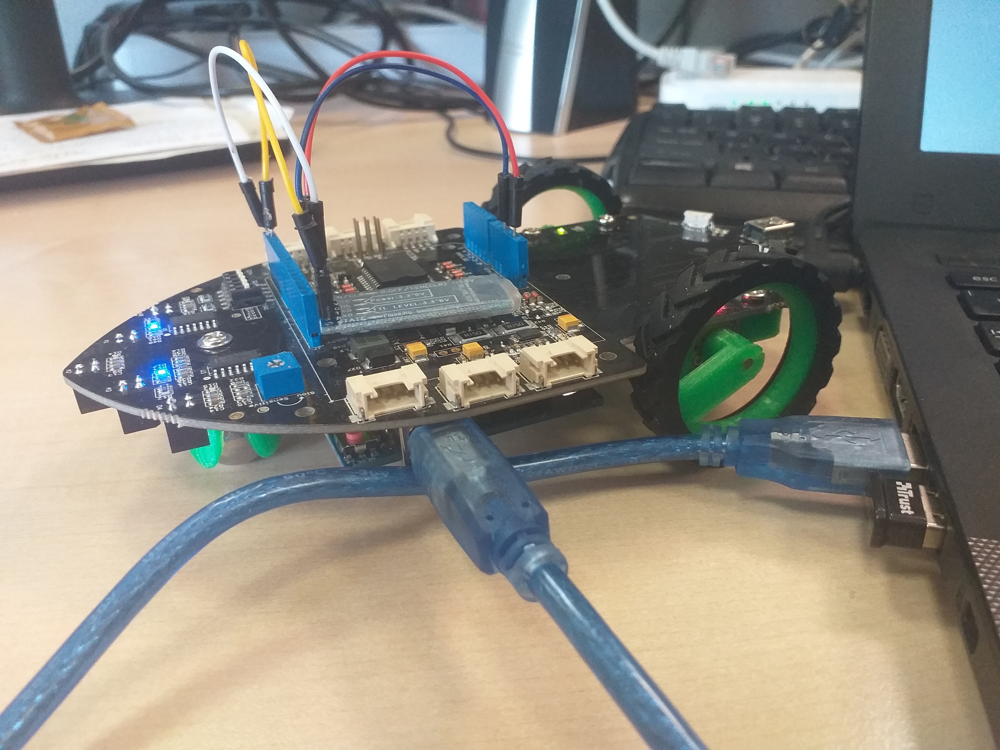

# Real-time smart-car skill Mycroft
This is a Mycroft skill to control a smart-car via voice commands.

Accepted commands are:
* go ahead
* go back
* turn left
* turn right

It has been tested under ARTe 1.6.11-r3 (http://arte.retis.santannapisa.it/). 

## Installation
Turn Mycroft on. Pair the HC-06 Arduino module with Mycroft/Linux using:

	hcitool scan  # to get the MAC address of your device
	bluetoothctl
	agent on
	scan on  # wait for your device's address to show up here
	scan off
	trust MAC_ADDRESS
	pair MAC_ADDRRESS
	connect MAC_ADDRESS 

Then, install the required packages and the skill

	sudo apt-get install bluetooth libbluetooth-dev bluez-tools
	sudo pip install pybluez
	cd /opt/mycroft/skills/
	git clone https://github.com/HerrAugust/skill-smart-car
	cd ~/mycroft/
	./stop-mycroft
	./start-mycroft debug

Of course, you need to register a Mycroft account.
Tested in Mycroft commit `c2904335f6f415fcaa246b5ac9ca7b8cdea3dbad` on Elementary OS 5 (November 2019) on a laptop with built-in microphone and speaker + bluetooth dongle. Funduino Uno and HC-06 bluetooth module have been used (RXD pin connected to digital pin 1; TXD pin connected to digital pin 0). Funduino Uno has been mounted on Shield Bot v1.2 (http://wiki.seeedstudio.com/Shield_Bot_V1.2/).

## Credits 
HerrAugust @ github.com
www.mascitti.info

## Category
**IoT**

## Tags
#iot
#smart-car
#mycroft